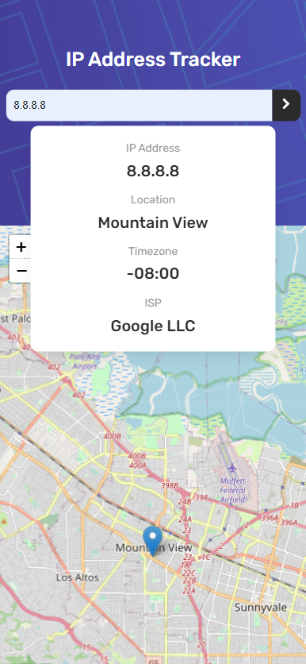
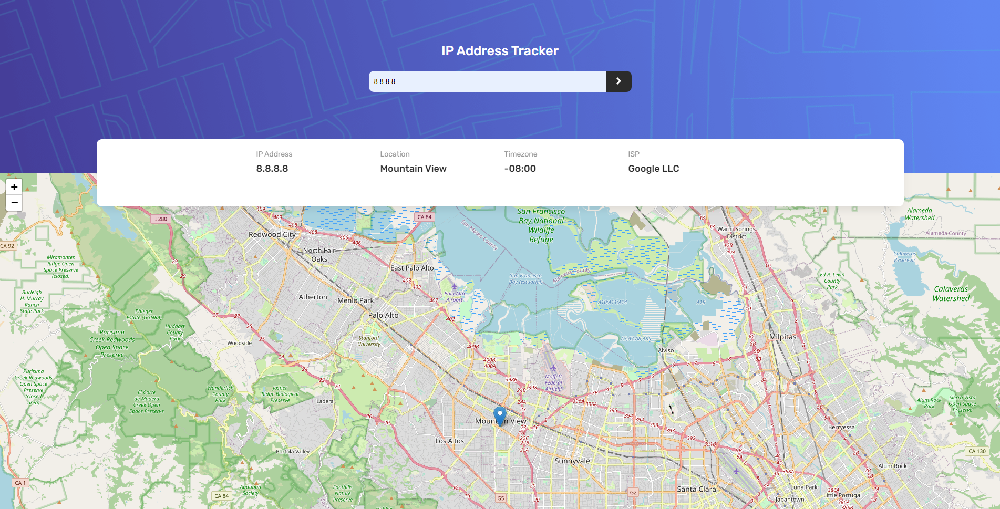

# Frontend Mentor - IP address tracker solution

This is a solution to the [IP address tracker challenge on Frontend Mentor](https://www.frontendmentor.io/challenges/ip-address-tracker-I8-0yYAH0). Design by Frontend Mentor, code by [akiraafu](https://github.com/akiraafu)

## Table of contents

- [Overview](#overview)
  - [The challenge](#the-challenge)
  - [Screenshot](#screenshot)
  - [Links](#links)
- [My process](#my-process)
  - [Built with](#built-with)
  - [What I learned](#what-i-learned)
  - [Continued development](#continued-development)
  - [Useful resources](#useful-resources)
- [Author](#author)

## Overview

### The challenge

Users should be able to:

- View the optimal layout for each page depending on their device's screen size
- See hover states for all interactive elements on the page
- See their own IP address on the map on the initial page load
- Search for any IP addresses and see the key information and location

### Screenshot




### Links

- Solution URL: [https://github.com/akiraafu/ip-address-tracker-react]
- Live Site URL: [https://ip-address-tracker-react-eight.vercel.app/]

## My process

### Built with

- React
- React Hooks (useState, useEffect)
- JavaScript
- Fetch
- async await
- Semantic HTML5 markup
- CSS custom properties
- Flexbox

### What I learned

```css
.proud-of-this-css {
  .header {
    min-height: 34vh;
  }
  @media (max-width: 768px) {
    .header .outputs {
      height: 100%;
      min-height: 15rem;
      flex-direction: column;
      top: 10rem;
      overflow: visible;
    }
  }
}
```

```js
const proudOfThisFunc = () => {
  function getGeoIp() {
    try {
      const getGeoIp = fetch(url)
        .then((response) => response.json())
        .then((data) => {
          return data;
        });

      const printAdd = async () => {
        const data = await getGeoIp;
        setData(data);
      };
      printAdd();
    } catch (err) {
      console.log(err.message);
    }
  }

  useEffect(() => {
    getGeoIp();
  }, [url]);

  const handleSubmit = (e) => {
    e.preventDefault();
    setIpAdd(e.target.elements.ip.value);
    getGeoIp();
  };
};
```

### Continued development

To implement better IP api

### Useful resources

- [MDN](https://developer.mozilla.org/en-US/)
- [Stackoverflow](https://stackoverflow.com/)
- [ipwhois.io API Docs](https://ipwhois.io/documentation)
- [React leaflet Docs](https://react-leaflet.js.org/docs/start-introduction/)

## Author

- Website - [akiraafu](https://github.com/akiraafu)
- Frontend Mentor - [@akiraafu](https://www.frontendmentor.io/profile/akiraafu)
